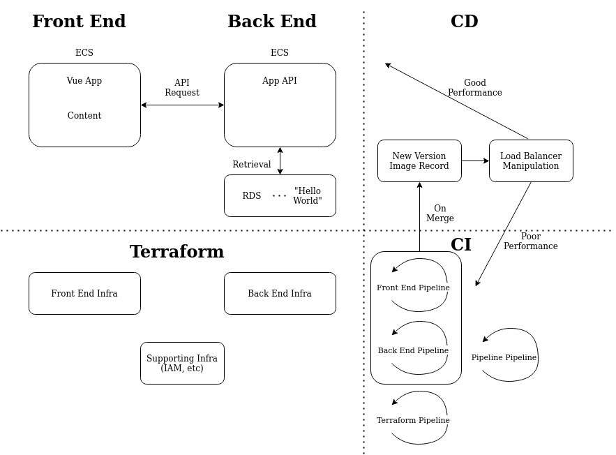

# Manheim Interview Project

## Table of Contents
1. [Description](#description)
2. [Prerequisites](#prerequisites)
3. [Repository Structure](#repository-structure)
4. [Setup and Configuration](#setup-and-configuration)
5. [CI/CD Pipeline](#ci-cd-pipeline)
6. [Canary Deployment Process](#canary-deployment-process)
7. [Monitoring and Alerts](#monitoring-and-alerts)
8. [Rolling Back Changes](#rolling-back-changes)
9. [Contributing](#contributing)
10. [Contact and Support](#contact-and-support)

## Description
This project consists of a Terraform repository to provision infrastructure, and a basic web application, along with the CI/CD pipelines needed to support these resources. The project is designed to demonstrate best practices in cloud infrastructure management, application deployment, and continuous integration and delivery processes.

## Prerequisites
- Linux Machine or equialent bash terminal to interact with the project files
- AWS account with necessary permissions
- Docker for building and running containers locally
- Terraform for infrastructure provisioning
- Git for version control
- GitHub account for managing CI/CD workflows

## Repository Structure
- `/terraform`: Contains Terraform configurations for AWS infrastructure provisioning.
- `/frontend`: Holds the source code for the front-end application.
- `/backend`: Contains the source code for the back-end application.
- `/.github/workflows`: Stores the GitHub Actions workflows for CI/CD.

## Setup and Configuration
<!-- Details on setting up the local development environment, configuring AWS services, and initializing Terraform for infrastructure management. -->
This project assumes that you you have an AWS account set up and have either configured the AWS CLI or have a necessary key pair to configure the AWS CLI.

Additionally, this project assumes that the user who runs project_init.sh has enough priviledge to:
- create resources in AWS including Users and delegate minimum priviledges to these Service Accounts and Roles:
    - a terraform Service Account which can create and destroy resources
    - a CI/CD user with permission to modify values of resources but not create or destroy them
    - a ECS role with permissions to be able to interact with resources such as reading or writing to RDS

The first step to running the project is to run the project_init.sh script which will configure the remote Terraform backend as well as create the initial users, roles, and workflows that will be used for the remainder of the project development.

## CI/CD Pipeline
<!-- Explains the automated processes for testing, building, and deploying the applications and infrastructure across different environments (NP and PR). -->
This project uses Github Actions CI/CD to create pipelines that govern the terraform infrastructure, as well as the application frontend and backend services. Finally, there is a pipeline which governs the CI/CD pipelines (ensuring at minimum that development on the CI/CD pipelines themselves will compile without errors.)

## Canary Deployment Process
<!-- Outlines the strategy and steps for implementing canary releases, including managing traffic through ALB target group weights and monitoring the deployment's success. -->
This project will use a script to perform a canary deployment procedure to a specified environment, starting with NP and PR, and having a scalable setup that can be applied to any new future environments.

## Monitoring and Alerts
<!-- Describes the monitoring setup using CloudWatch, how to configure alerts for system events, and responding to incidents. -->
This project will use a simple cloudwatch alert to monitor the performance of our web application. This can be used for monitoring performance for PR as well as to monitor the progression of our canary deployments.

## Rolling Back Changes
<!-- Instructions on how to rollback application and infrastructure changes in case of deployment issues or other operational failures. -->
This project will use simple conditions to ensure that the canary deployment is able to be reverted in the case that the new PR version is not performing as expected.

## Contact and Support
<!-- Provides contact information and support resources for project maintainers and contributors. -->
Please contact me at aut0m4t0r@outlook.com with any questions. Thank you!
